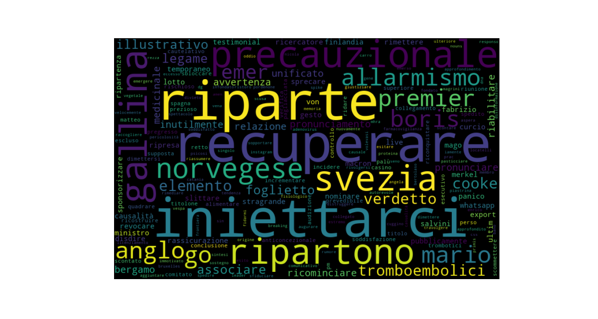
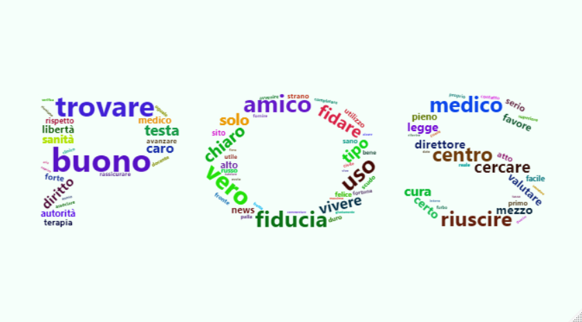

```{r setup, include=FALSE}
knitr::opts_chunk$set(echo = TRUE)
```

### *STATISTICHE*

Query sui seguenti hashtags: #vaccinoCovid OR #VaccinoAntiCovid OR #vaccino OR #PfizerVaccine OR #AstraZeneca. Estrazione senza retweets.

+-----------------------------+---------------+
| Twitter's features          | N             |
+=============================+===============+
| Tweets                      | 65451         |
+-----------------------------+---------------+
| Days                        | 63            |
+-----------------------------+---------------+
| Users                       | 18415         |
+-----------------------------+---------------+
| Retweets                    | 132278        |
+-----------------------------+---------------+
| Users Verified              | 3327          |
+-----------------------------+---------------+
| Mean Tweets per day (round) | 1039          |
+-----------------------------+---------------+
| Hashtags all                | 227377        |
+-----------------------------+---------------+
| Hashtags unique             | 15024         |
+-----------------------------+---------------+

: Tab 1 - Descriptives

Le seguenti statistiche lessicali sono comprendono gli indici della ricchezza del vocabolario, poiché affetti da distorsioni dovuti all'altissimo numero delle occorrenze..

Basandosi solo sulle frequenze del corpus pulito, si può apprezzare, con le dovute cautele, un vocabolario con un discreto livello di ricchezza lessicale: a fronte di una riduzione del 60% dei tokens, rispetto al testo originale intero, i types sono scesi poco meno del 13%.

| Metric                 | All Tokens  | Cleaned Tokens | Cleaned Lemmas |
|------------------------|-------------|----------------|----------------|
| Tokens                 | 1462113     | 581001         | --             |
| Types                  | 47670       | 41739          | --             |
| Unique Words (hapax) % | 49          | 48             | 51             |
| Mode                   | "di": 70555 | "non": 22939   | "non": 23195   |
| Mean                   | 30,67       | 13,92          | 17,45          |
| SD                     | 635,33      | 136,81         | 164,82         |
| Lemmas                 | --          | --             | 33291          |

: Tab 2 - Lessicometrics

Il Grafico 1 mostra la frequenza delle parti del discorso denotando un elevato numero di nomi e verbi mentre più contenute sono le altre POS relative ai termini semanticamente significativi, in particolare gli aggettivi. Per un confronto sull'uso dell'italiano nel microblogging, si rimanda a Zaga(2012)


**PREPROCESSING ED ESTRAZIONE DELLE FEATURES**

1.  Cleaning dei tweets: rimozione delle peculiarità grafiche dei tweets: urls, simboli, caratteri non ASCII.

2.  Estrazione delle Features: Tokenizzazione, Lemmatizzazione e POS Tagging. Il match con il dizionario OpeNER Sentiment Lexicon Italian (ISL) è stato fatto sui lemmi. Per le annotazioni ho utilizzato il modello italiano UDPIPE italian-postwita-ud-2.5-191206, escludendo il parsing morfo-sintattico.

3.  Creazione di una categoria separata "NEGATOR" comprendente i più comuni e frequenti termini negativizzanti: "non, no, mai, senza, neppure, neache, nemmeno".

4.  Riduzione delle Features: rimozione delle parti del discorso prive di valenza semantica, mantenendo solo: nomi, aggettivi, verbi, avverbi e i negatori. Rimossi inoltri alcuni avverbi di uso molto frequente e poco significiativi. (es. ora, più, adesso ecc.)

5.  GESTIONE DI NEGATORI E POLISEMIA

    -   L'approccio metodologico lexicon-based non consente una gestione puntuale dei termini positivi, o negativi, la cui polarità viene ribaltata quando preceduti dal negatore (es. "bello vs non bello, brutto vs non brutto" ecc). Il lessico ISL inoltre non li contiene; per mantenere un computo complessivo del sentiment quanto più possibile prossimo al valore effettivo, seppur con i limiti del caso, ho deciso di attribuire il punteggio -1 agli avverbi, preposizioni e congiunzioni della lista "NEGATOR". Alquanto complessa e senza sostanziali differenze la gestione dei negatori che ho testato tramite analisi degli *n-grams*.

    -   Il totale dei negatori rappresenta comunque una minima parte del vocabolario, pari a n 29115/581001 (ovvero solo il 5% dei token nel corpus cleaned)

    -   Ho rinunciato alla gestione della polisemia e della sua disambiguazione in quanto troppo complessa e con risultati dubbi per questa metodologia.

**ANALISI DEL SENTIMENT**

Il sentiment (fig. 2) si distribuisce normalmente ma appare più polarizzato al negativo anche se il suo valore trend non è marcatamente negativo. Si nota tuttavia un andamento lievemente positivo nelle due settimane finali di aprile, circa dal 18 al 30. Spiccano almento due gruppi di giorni con i più alti picchi di sentiment sia negativi che positivi.


Visualizziamo nel dettaglio i due gruppi e un giorno singolo in base al sentiment e le parole che sono maggiormente caratteristiche, tentando, tramite lo scoring Tf-Idf, una loro tematizzazione:

-   Gruppo 1) dal 15 al 17 marzo. Polarizzazione marcatamente negativa. Si registra un' alta percentuale di numero di parole del corpus 18,13 % (il 16 marzo è il giorno con il numero assoluto più alto dell'intero corpus: 11,64 %)


-   Gruppo 2) dal 18 al 20 marzo. Polarizzazione marcatemente positiva. Anche in questo gruppo la percentuale totale delle parole è 11,98 %



-   07 aprile. Polarizzazione marcatamente negativa. Percentuale parole 4,71 %.


Di seguito invece la wordcloud delle parole più frequenti dell'intero corpus e di quelle, sempre più frequenti, dei due poli del seintiment, positivo e negativo





L'utilizzo delle Emojis è pari al solo 16,82 % del totale dei tweets. Il sentiment risulta tuttavia polarizzato positivamente  
  


