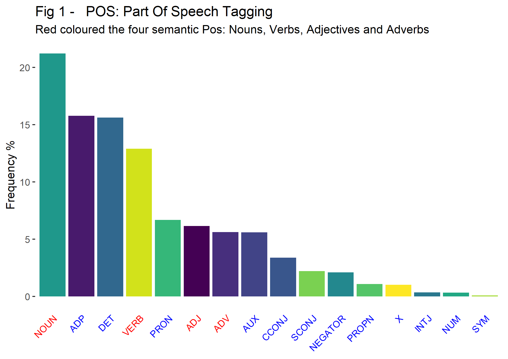
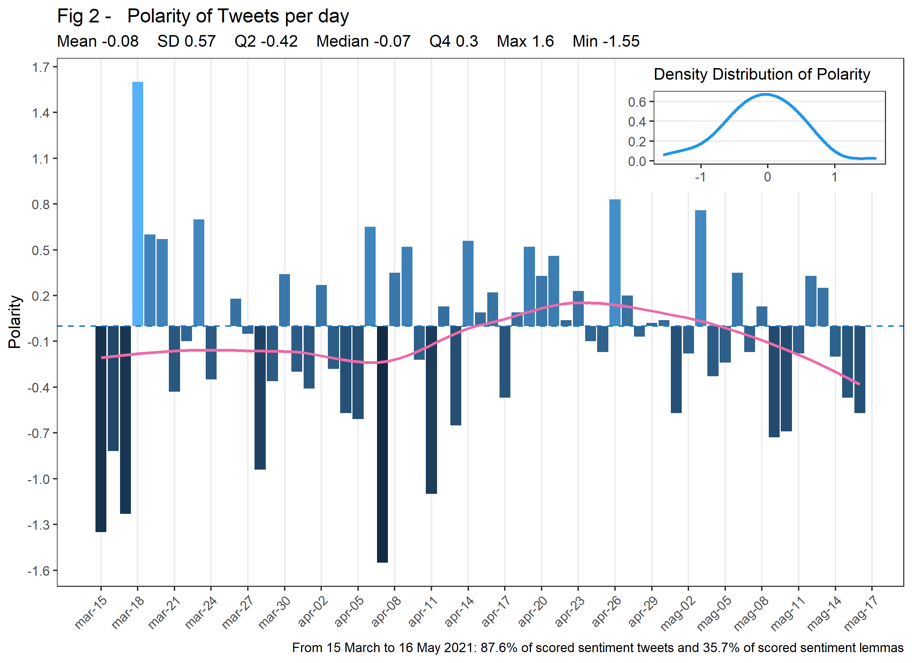
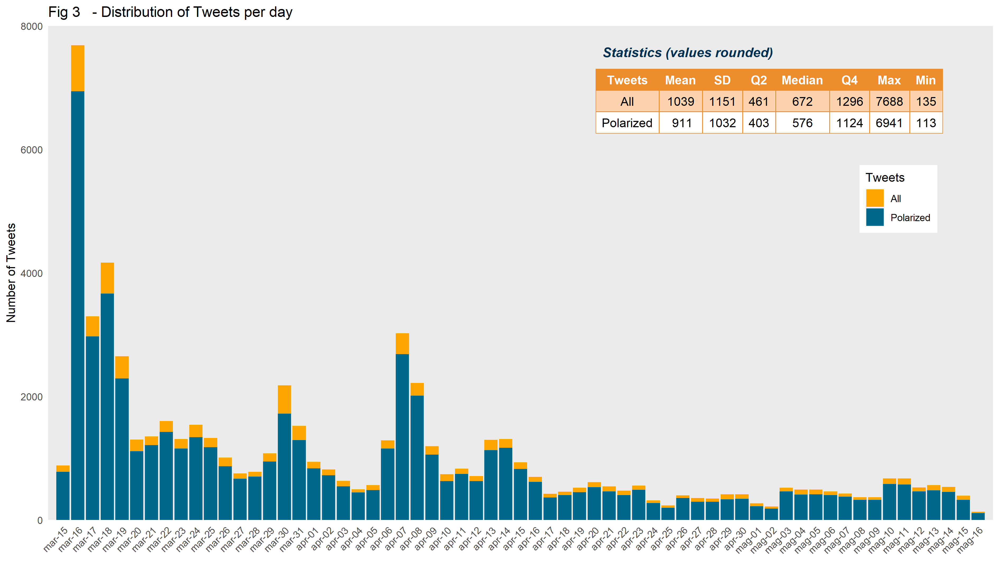
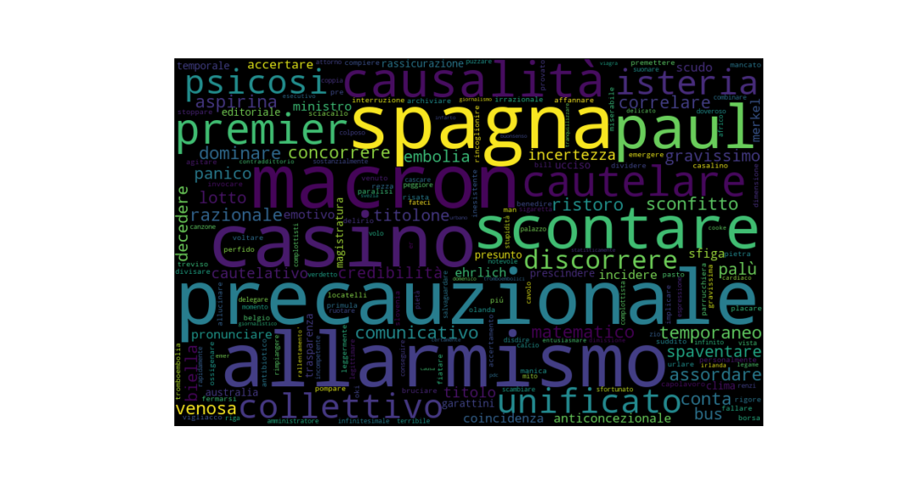
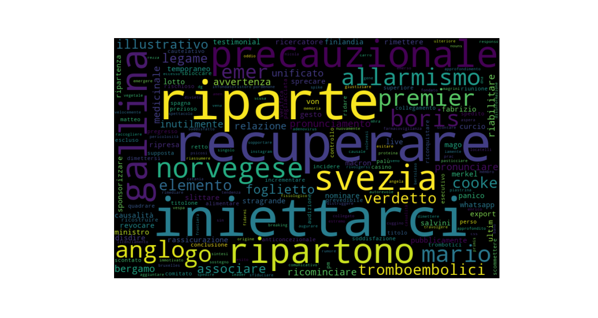
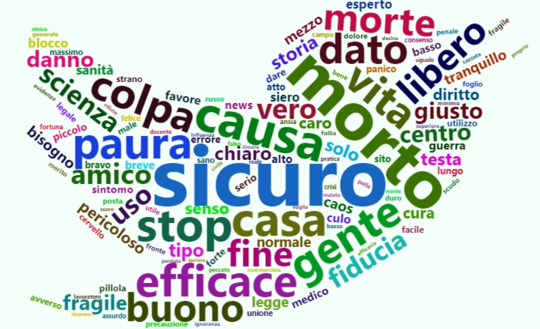
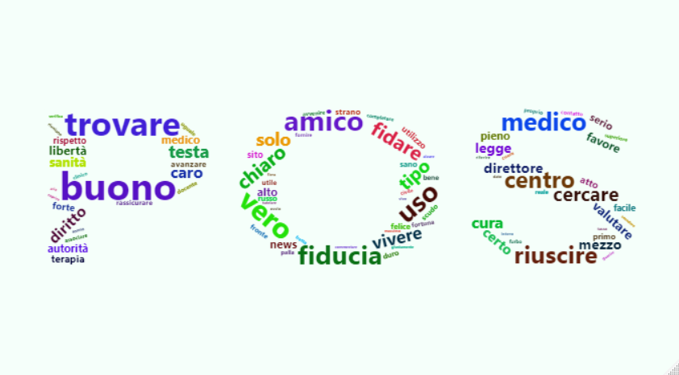
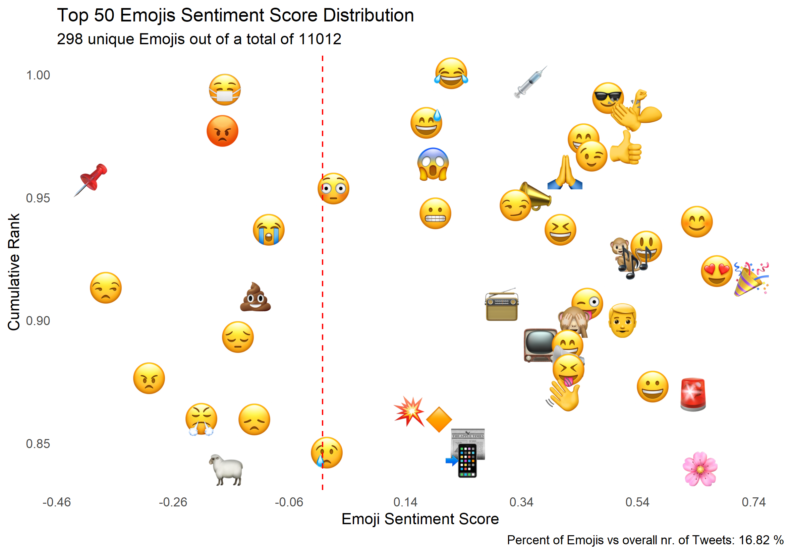

Sentiment and Linguistic Analysis
================

### *STATISTICHE*

Query sui seguenti hashtags: #vaccinoCovid OR #VaccinoAntiCovid OR
#vaccino OR #PfizerVaccine OR #AstraZeneca. Estrazione senza retweets.

| Twitter’s features          | N      |
|-----------------------------|--------|
| Tweets                      | 65451  |
| Days                        | 63     |
| Users                       | 18415  |
| Retweets                    | 132278 |
| Users Verified              | 3327   |
| Mean Tweets per day (round) | 1039   |
| Hashtags all                | 227377 |
| Hashtags unique             | 15024  |

Tab 1 - Descriptives

Le seguenti statistiche lessicali sono comprendono gli indici della
ricchezza del vocabolario, poiché affetti da distorsioni dovuti
all’altissimo numero delle occorrenze..

Basandosi solo sulle frequenze del corpus pulito, si può apprezzare, con
le dovute cautele, un vocabolario con un discreto livello di ricchezza
lessicale: a fronte di una riduzione del 60% dei tokens, rispetto al
testo originale intero, i types sono scesi poco meno del 13%.

| Metric                 | All Tokens  | Cleaned Tokens | Cleaned Lemmas |
|------------------------|-------------|----------------|----------------|
| Tokens                 | 1462113     | 581001         | –              |
| Types                  | 47670       | 41739          | –              |
| Unique Words (hapax) % | 49          | 48             | 51             |
| Mode                   | “di”: 70555 | “non”: 22939   | “non”: 23195   |
| Mean                   | 30,67       | 13,92          | 17,45          |
| SD                     | 635,33      | 136,81         | 164,82         |
| Lemmas                 | –           | –              | 33291          |

Tab 2 - Lessicometrics

Il Grafico 1 mostra la frequenza delle parti del discorso denotando un
elevato numero di nomi e verbi mentre più contenute sono le altre POS
relative ai termini semanticamente significativi, in particolare gli
aggettivi. Per un confronto sull’uso dell’italiano nel microblogging, si
rimanda a Zaga(2012)

**PREPROCESSING ED ESTRAZIONE DELLE FEATURES**

1.  Cleaning dei tweets: rimozione delle peculiarità grafiche dei
    tweets: urls, simboli, caratteri non ASCII.

2.  Estrazione delle Features: Tokenizzazione, Lemmatizzazione e POS
    Tagging. Il match con il dizionario OpeNER Sentiment Lexicon Italian
    (ISL) è stato fatto sui lemmi. Per le annotazioni ho utilizzato il
    modello italiano UDPIPE italian-postwita-ud-2.5-191206, escludendo
    il parsing morfo-sintattico.

3.  Creazione di una categoria separata “NEGATOR” comprendente i più
    comuni e frequenti termini negativizzanti: “non, no, mai, senza,
    neppure, neache, nemmeno”.

4.  Riduzione delle Features: rimozione delle parti del discorso prive
    di valenza semantica, mantenendo solo: nomi, aggettivi, verbi,
    avverbi e i negatori. Rimossi inoltri alcuni avverbi di uso molto
    frequente e poco significiativi. (es. ora, più, adesso ecc.)

5.  GESTIONE DI NEGATORI E POLISEMIA

    -   L’approccio metodologico lexicon-based non consente una gestione
        puntuale dei termini positivi, o negativi, la cui polarità viene
        ribaltata quando preceduti dal negatore (es. “bello vs non
        bello, brutto vs non brutto” ecc). Il lessico ISL inoltre non li
        contiene; per mantenere un computo complessivo del sentiment
        quanto più possibile prossimo al valore effettivo, seppur con i
        limiti del caso, ho deciso di attribuire il punteggio -1 agli
        avverbi, preposizioni e congiunzioni della lista “NEGATOR”.
        Alquanto complessa e senza sostanziali differenze la gestione
        dei negatori che ho testato tramite analisi degli *n-grams*.

    -   Il totale dei negatori rappresenta comunque una minima parte del
        vocabolario, pari a n 29115/581001 (ovvero solo il 5% dei token
        nel corpus cleaned)

    -   Ho rinunciato alla gestione della polisemia e della sua
        disambiguazione in quanto troppo complessa e con risultati dubbi
        per questa metodologia.

**ANALISI DEL SENTIMENT**

Il sentiment (fig. 2) si distribuisce normalmente ma appare più
polarizzato al negativo anche se il suo valore trend non è marcatamente
negativo. Si nota tuttavia un andamento lievemente positivo nelle due
settimane finali di aprile, circa dal 18 al 30. Spiccano almento due
gruppi di giorni con i più alti picchi di sentiment sia negativi che
positivi.

Visualizziamo nel dettaglio i due gruppi e un giorno singolo in base al
sentiment e le parole che sono maggiormente caratteristiche, tentando,
tramite lo scoring Tf-Idf, una loro tematizzazione:

-   Gruppo 1) dal 15 al 17 marzo. Polarizzazione marcatamente negativa.
    Si registra un’ alta percentuale di numero di parole del corpus
    18,13 % (il 16 marzo è il giorno con il numero assoluto più alto
    dell’intero corpus: 11,64 %)

-   Gruppo 2) dal 18 al 20 marzo. Polarizzazione marcatemente positiva.
    Anche in questo gruppo la percentuale totale delle parole è 11,98 %

-   07 aprile. Polarizzazione marcatamente negativa. Percentuale parole
    4,71 %.

Di seguito invece la wordcloud delle parole più frequenti dell’intero
corpus e di quelle, sempre più frequenti, dei due poli del seintiment,
positivo e negativo

L’utilizzo delle Emojis è pari al solo 16,82 % del totale dei tweets. Il
sentiment risulta tuttavia polarizzato positivamente

